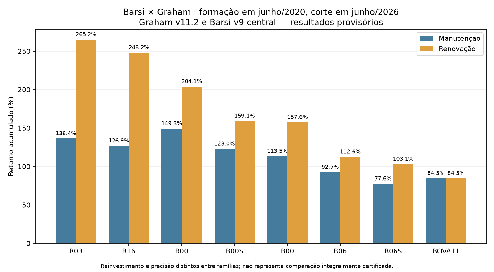

# Barsi × Graham — execução v11 e revisões documentais v11.1/v11.2

Data: 07/10/2026. Corte econômico: 30/06/2026. **Apuração executada; certificação documental integral pendente.**

A manutenção Graham foi concluída nas 18 carteiras e comparada às quatro estratégias Barsi e ao BOVA11. A versão principal é **v11.2**, com reinvestimento na data-ex das restituições SYNE3 e monetização dos direitos ITSA3 seguida de reinvestimento após liquidação, conforme as instruções do usuário. A [auditoria dos direitos](graham_v11_2_direitos_itsa.md) detalha as evidências, quantidades inteiras e impactos. Os cenários v11 e v11.1 sem monetização dos direitos foram preservados.

Os arquivos estão em [execution_v11_2_2026_10_07](../research/graham_v6_comparison/execution_v11_2_2026_10_07/). O manifesto de cada arquivo permite verificar a integridade do conjunto. Valores nos CSVs são frações; `*_pp` são pontos percentuais. Os cálculos não arredondam intermediários.

## Resultados principais

Formação em 30/06/2020 e avaliação em 30/06/2026; Barsi no cenário central:

| Estratégia | Manutenção | CAGR manutenção | Renovação | CAGR renovação |
|---|---:|---:|---:|---:|
| R00 | +149,3140% | 16,4500% | +204,1233% | 20,3723% |
| R03 | +136,3945% | 15,4216% | +265,1978% | 24,1012% |
| R16 | +126,8531% | 14,6316% | +248,1894% | 23,1185% |
| B00 | +113,4811% | 13,4765% | +157,6330% | 17,0889% |
| B00S | +122,9962% | 14,3044% | +159,0876% | 17,1989% |
| B06 | +92,6704% | 11,5527% | +112,6464% | 13,4024% |
| B06S | +77,6461% | 10,0531% | +103,1389% | 12,5409% |
| BOVA11 | +84,5121% | 10,7510% | +84,5121% | 10,7510% |



A maior renovação central é R03; a maior manutenção da coorte 2020 é R00. Essa ordem não se repete necessariamente nas demais formações. Por exemplo, em 2021 a manutenção R03/R16 chega a +260,9826%, superior à renovação correspondente. Na formação de 2025, os mecanismos Graham coincidem, pois existe um único período anual.

As seis formações compartilham parte do histórico. Não são seis experimentos independentes e este relatório não estima significância estatística ou desempenho futuro. A diferença entre R16 e B00S na manutenção de 2020 é pequena em relação às incertezas de apuração. A classificação central não deve ser tratada como dominância certificada.

## Falha corrigida e invariantes

Os scripts locais eram idênticos aos do PR em `7555445`. Diferentemente do estado descrito na missão, já existia uma tentativa v11 local: quatro posições com UNIP3 falhavam na data intermediária 14/05/2025.

A ponte carregava `motor_eventos` como módulo de topo, enquanto v11 importava novamente `graham_v6_event_bridge.motor_eventos`. Isso criava duas classes `MissingData`: a exceção de `PriceBook.exact` não era reconhecida por `Engine.value(strict=False)`. O script passou a reutilizar `bridge.Engine` e `bridge.Event`. **O motor original permaneceu byte a byte idêntico ao pacote fornecido.**

A ausência de negócio de UNIP3 em 14/05/2025 foi confirmada no COTAHIST local. Não foi feito preenchimento de preço. Somente o NAV desse dia fica indisponível. Entrada, saída e reinvestimento continuam exigindo cotação exata; os testes cobrem as três falhas obrigatórias.

Validações efetivamente executadas:

- 34 testes novos de regressão, conciliação e direitos: aprovados.
- 33 testes originais do motor, recuperados no pacote herdado: aprovados.
- Paridade histórica v6: 18/18; primeiro ano da manutenção versus anual corrigido v10: 18/18 na v11/v11.1. Na v11.2, 18/18 primeiros anos reproduzem os anuais recalculados com direitos; a paridade v10 é verificada separadamente no cenário sem monetização.
- 18/18 carteiras Graham conciliadas por pesos, contribuições, quantidades finais, caixa e cálculo multiativo; 162 posições e 63 intervalos anuais de manutenção.
- Barsi v9: quatro scripts originais executados, 15/15 CSVs idênticos por SHA-256; os 104 registros dos três arquivos congelados coincidem com o pacote.
- 96/96 carteiras Barsi anuais/manutenção conciliadas por pesos e contribuições, totalizando 1.212 registros; datas confrontadas com Graham.
- Comparação principal: 72 registros e 96 posições de ranking. Benchmark nas mesmas datas, incluindo 28/06/2024.

Testes de software e igualdade com o histórico não certificam completude documental.

## Correções documentais v11.1, preservadas como etapa anterior

As alterações UNIP3/SYNE3 são registradas em `manutencao_documental_v11_1/alteracoes_documentais.csv` e não alteram seleções nem os 18 retornos anuais v10. A revisão posterior dos direitos ITSA3 recalcula explicitamente os períodos afetados, preservando esses arquivos anteriores.

1. **UNIP3:** três parcelas distintas omitidas da suplementação foram adicionadas: R$ 1,96753967760 em 19/11/2024; R$ 0,12945555370 em 12/08/2025; R$ 5,48220258487 em 05/12/2025, todas datas-com. As outras parcelas dessas mesmas datas foram mantidas separadamente. [Tabela oficial da Unipar](https://ri.unipar.com/informacoes-aos-investidores/proventos-e-bonificacoes/).
2. **SYNE3:** o dividendo com data-ex 15/12/2025 foi corrigido de R$ 0,0585805792 para R$ 0,419275002113572 por ação. Foram incorporadas restituições de R$ 3,66865626849375, ex em 09/12/2024, e R$ 2,1618867296481, ex em 18/09/2025. [Histórico oficial da SYN](https://ri.syn.com.br/governanca-corporativa/politica-de-dividendos-e-historico/).
3. **SYNE3:** foi retirado o suposto split 2:1 de 10/12/2024 cuja origem era `DETECTED`. Os documentos descrevem restituição sem cancelamento de ações; a queda de cotação não basta para criar ações. [Documento de 2024](https://api.mziq.com/mzfilemanager/v2/d/9ceaac6b-8c40-4396-9c2d-44bd2d41ef3e/a49ef94c-4c46-8535-8039-a6382fc769c0?origin=1), [documento de 2025](https://api.mziq.com/mzfilemanager/v2/d/9ceaac6b-8c40-4396-9c2d-44bd2d41ef3e/59c6fc07-5e89-271e-4618-ce94371d4b8f?origin=1).

Impacto nas carteiras que mudaram, até 30/06/2026:

| Formação/regra | v11 reproduzida | v11.1 sem direitos | Diferença |
|---|---:|---:|---:|
| 2022 R00 | +103,8220% | +118,8876% | +15,0656 pp |
| 2022 R03 | +144,9918% | +155,7362% | +10,7443 pp |
| 2022 R16 | +94,6135% | +103,7941% | +9,1806 pp |
| 2023 R03 | +82,9603% | +84,4127% | +1,4524 pp |
| 2023 R16 | +61,3656% | +63,4405% | +2,0748 pp |

O cenário alternativo conserva as correções documentais e mantém as restituições em caixa não remunerado. Em 2022, ele resulta em R00 +110,1097%, R03 +150,0932%, R16 +99,4051%. A diferença entre esses cenários isola a política de reinvestimento; a diferença versus v11 também contém as correções de dados.

## Barsi: reprodução e conciliação patrimonial

O arquivo fornecido durante a execução foi `Pacote_Barsi_Graham_Comparacao_Final_v9_2026-10-06.zip`, SHA-256 `52911a31c01f5466e0d161d1d21ea8bbab1aa5aad3454bd0b943c1122df307a9`. O ZIP de aproximadamente 77 MB e seus dados herdados permanecem locais.

A v9 substituía o fator final de algumas posições por um checkpoint v6, mas conservava os campos de caixa e ações da aproximação. Isso causava 32 diferenças patrimoniais em ENBR3 e CSMG3, embora as contribuições dos retornos estivessem corretas. A maior diferença ponderada individual era 3,18485 pp, em CSMG3/B00S central, formação 2022.

`reconcile_besst_v9_anchors.py` recuperou o caixa e as quantidades do **mesmo checkpoint** usado no retorno. As 606 posições de manutenção agora conciliam com as 48 carteiras: zero diferenças aritméticas, zero alterações de retorno ou seleção. A versão original foi preservada, e cada ajuste aponta o arquivo e o hash do checkpoint. Posições sem âncora permanecem estimativas da v9.

## Evidências e cobertura que permanece aberta

Foram confrontadas **116 cotações nominais** com os arquivos COTAHIST locais: todas coincidem, incluindo as 24 pontas dos 12 ativo/ano, preços de eventos e sete datas do BOVA11. Um 117º alvo, UNIP3 em 14/05/2025, está ausente tanto da base quanto do arquivo bruto e não é preço necessário para uma operação. Os ZIPs, linhas e registros estão identificados por hash. Isso verifica a ingestão contra arquivos originais locais; não é uma segunda coleta independente da B3.

A transcrição factual das tabelas oficiais de Itaúsa, Unipar e SYN contém 61 registros. No diagnóstico v11, 55 coincidiam; os seis restantes correspondem às três parcelas UNIP3, ao dividendo SYNE3 divergente e às duas restituições. A política aprovada e os sete lançamentos de alteração tratam essas diferenças na v11.1. O servidor de RI recusou download direto com HTTP 403; as páginas foram consultadas pela ferramenta web. O hash da transcrição **não** é apresentado como hash do HTML original.

| Ativo/anos pendentes | Evidência obtida nesta execução | O que impede certificação integral |
|---|---|---|
| ITSA3 2022–2025 | 41 registros de caixa confrontados; bonificações 2022–2025 corroboradas no RI; preços brutos | Direitos 2023/2025 documentados e simulados na v11.2; ainda completar catálogo independente de todos os eventos |
| UNIP3 2022/2023 | Parcelas anuais preservadas; bonificação de 10% e três parcelas posteriores verificadas | Completude independente do catálogo e atualização até o corte |
| SBSP3 2025 | Duas bonificações e split 1:5 corroborados; cotações nominais | Conferência integral dos JCP e de todos os eventos no intervalo |
| TGMA3 2025 | Cinco proventos documentados anteriormente; preços conferidos; relatório 2T26 informa ausência de JCP em abril/26 | Completar verificação de todos os eventos; ausência de JCP não prova ausência de qualquer distribuição |
| CSAN3 2022 | Preços e pagamento arredondado a R$ 0,43 no RI | Documento do valor nominal exato e data-com, além de estrutura |
| SYNE3 2022 | Pontas conferidas; nenhuma distribuição listada pelo RI naquela janela; correções posteriores aplicadas na manutenção | Demonstrar completude da janela por catálogo/documentos, além de tabela de dividendos |
| ALOS3 2024/2025 | Preços e duas tranches de cada data já preservadas na entrada local | Confronto integral dos avisos e eventuais revisões por ações em tesouraria |

Fontes adicionais: [Itaúsa — remuneração, bonificações e subscrições](https://ri.itausa.com.br/informacoes-financeiras/remuneracao-aos-acionistas/); [Sabesp — bonificação dezembro/2025](https://www.sec.gov/Archives/edgar/data/1170858/000129281425004333/sbs20251219_6k.htm), [B3 — bonificação março/2026](https://sistemasweb.b3.com.br/PlantaoNoticias/Noticias/Detail?agencia=18&dataNoticia=2026-03-20+18%3A04%3A41&idNoticia=3287363), [Sabesp — split](https://www.sec.gov/Archives/edgar/data/1170858/000129281426002627/sbs20260428_6k.htm); [Tegma — resultados 2T26](https://ri.tegma.com.br/earnings-release-do-2t26/); [Cosan — dividendos](https://www.cosan.com.br/relacoes-com-investidores/outras-informacoes-para-investidores/dividendos/); [ALLOS — avisos](https://ri.allos.com.br/servicos-aos-investidores/comunicados-e-fatos-relevantes/).

Permanecem 45 alertas da varredura B3, além da matriz de 12 ativo/ano. Esses alertas incluem diferenças de agregação e datas possivelmente sem exposição; não são 45 erros econômicos confirmados. Nenhuma cobertura foi promovida automaticamente a `RECONCILED`.

## Limites da comparação

Graham usa preços nominais, quantidades de ações fracionárias e proventos brutos reinvestidos na data-ex, incluindo proventos com pagamento posterior ao corte. Na v11.2, os direitos ITSA3 são inteiros, vendidos no mercado fracionário e reinvestidos após D+2. O capital inicial é R$ 10.000 por carteira; a renovação transporta o patrimônio efetivo entre anos devido ao descarte das frações dos direitos. Barsi v9 mistura cálculos por evento/checkpoints com aproximações de caixa anual e reinvestimento no fim do intervalo. A v9 usa sensibilidades de caixa de ±20% nos anuais e ±5% na manutenção; são hipóteses distintas, não intervalos de confiança. Custos, impostos e liquidez real não foram simulados.

A formação utiliza as seleções auditadas entregues, sem refazer critérios, universo, nomes ou pesos. Esta execução valida a reprodução dessas seleções, mas não reabre a prova de disponibilidade histórica de cada demonstração, revisão contábil ou informação usada nos filtros. Não se deduz ausência de look-ahead ou viés de sobrevivência apenas dos testes de retorno.

## Reprodução

Dependências pequenas preexistentes foram incorporadas **sem alteração**, com origem e hashes em [inputs_v11_manifest.json](../research/graham_v6_comparison/inputs_v11_manifest.json). O SQLite, COTAHIST e pacote v9 não são versionados. O SQLite deve ficar na raiz e os COTAHIST em `data/raw`, ou usar `--raw-dir`. Use uma cópia isolada e destinos novos para preservar checkpoints.

```bash
python -m pytest -q tests/test_graham_maintenance_v11.py
python scripts/graham_corrected_maintenance_v11.py
python scripts/compare_maintenance_graham_barsi_v11.py
python scripts/audit_graham_v11_sources.py --raw-dir data/raw
python scripts/graham_v11_documentary_sensitivity.py
python scripts/audit_besst_v9_package.py /caminho/Pacote_Barsi_Graham_Comparacao_Final_v9_2026-10-06.zip
python scripts/reconcile_besst_v9_anchors.py
python scripts/graham_corrected_maintenance_v11.py --documentary-policy REINVEST
python scripts/compare_maintenance_graham_barsi_v11.py --graham-dir graham_v6_event_results/manutencao_documental_v11_1 --out graham_v6_event_results/comparacao_documental_v11_1
python scripts/validate_graham_v11_outputs.py --graham-dir graham_v6_event_results/manutencao_documental_v11_1 --comparison-dir graham_v6_event_results/comparacao_documental_v11_1
```

Para completar a v11.2, executar também os comandos do [relatório dos direitos](graham_v11_2_direitos_itsa.md). O auditor Barsi exige cache novo e recusa sobrescrever uma reprodução existente. Os comandos usam o motor fornecido, sem recalibração para perseguir retornos antigos. A comparação principal atual está em `direitos_itsa_v11_2/comparacao_72_cenarios.csv`; `comparacao_documental_v11_1` é a sensibilidade sem monetização dos direitos.

## Checkpoint para o coordenador

**CHECKPOINT — Barsi × Graham**

- Etapa concluída: 18 manutenções Graham, comparação de 72 cenários, reprodução Barsi e correções documentais v11.1 e monetização dos direitos ITSA3 v11.2 executadas.
- Arquivos alterados: scripts de manutenção/comparação; novos auditores, testes, relatório, manifestos e CSVs de execução. Motor original e seleções preservados.
- Testes executados e resultado: 34 novos + 33 herdados aprovados; paridades 18/18; Barsi 15/15 CSVs idênticos, 96/96 carteiras conciliadas; patrimônio Barsi 48/48 após ajuste de apresentação.
- Resultados numéricos novos: manutenção 2020 R00 +149,3140%, R03 +136,3945%, R16 +126,8531%; direitos acrescentam respectivamente +0,2673/+0,1551/+0,2243 pp. Renovação 2020 R00 +204,1233%, R03 +265,1978%, R16 +248,1894%.
- Pendências identificadas: 12 ativo/ano ainda sem certificação integral, 45 alertas B3 a classificar e precisão material da v9. Os dois eventos de direitos ITSA3 já foram documentados e simulados.
- Decisões metodológicas necessárias: políticas SYNE3 e ITSA3 aprovadas pelo usuário e implementadas; permanece a decisão sobre precisão comparável entre famílias.
- Commit/branch/PR: branch `audit/graham-v6-coverage-7`, PR #1; ver histórico Git para o hash desta entrega.
- Próxima etapa recomendada: classificar os alertas por exposição efetiva e completar os documentos dos 12 ativo/ano antes de uma conclusão certificada.
