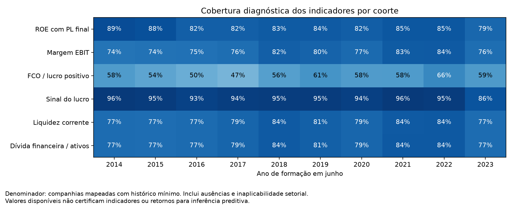

# Cobertura histórica para investigar multiplicadoras e perdas graves na B3

A etapa preliminar encontrou dados suficientes para construir um painel diagnóstico, mas identificou impedimentos materiais à estimação preditiva. O painel contém **2.588 observações de 399 companhias**, formadas em junho de 2014 a 2023. **Nenhuma combinação foi validada e nenhum retorno total foi certificado nesta etapa.** Isso não demonstra ausência de poder preditivo dos fundamentos; demonstra que os dados existentes ainda não permitem responder à pergunta com o rigor solicitado.

A investigação está separada dos estudos Graham/Barsi. O SQLite foi aberto em modo somente leitura e seu SHA-256 permaneceu `0ab5d487ec8e6efe7c995a7bec5f0ae4e6602fc734dfbd4bc96e7cc4c82c3211`. Os arquivos, seleções, livros de eventos e resultados anteriores permanecem preservados. A execução reutilizou os arquivos locais e não realizou downloads.

## Matriz de cobertura e impedimentos

| Componente | Cobertura efetivamente encontrada | Impedimento material | Decisão nesta etapa |
|---|---|---|---|
| Preços SQLite | 2.606.983 registros, de janeiro de 1994 a outubro de 2026 | O parser admite somente BDI `02`; exclui parte da negociação de empresas em dificuldade | Usar o banco como fonte auditada parcialmente e comparar com os ZIPs originais |
| Preços originais B3 | ZIPs locais de 1994 a 2026; auditoria integral das ações e units de 2014 a 2026 no mercado `010` | **66.518 registros presentes nos originais não aparecem no banco**; ausência não equivale a deslistagem | Preservar agregados de cobertura e cotações de formação com arquivo, linha e hash |
| Balanços CVM no SQLite | 10.858 DFP e 31.178 ITR; DFP desde 2010, ITR desde 2011 | Quase sempre uma única versão por companhia e período | Conferir a versão conhecida no corte contra os metadados dos ZIPs |
| Versões de balanços | Metadados DFP com 14.011 registros de versões e datas; ITR com 35.726 | **3.150 registros DFP e 4.546 ITR sem valores correspondentes no SQLite** | Versão conhecida sem valores permanece ausente; não substituir pelo balanço antigo |
| Capital por classe | FRE desde 2010; colunas de ações totais, ON e PN no banco | Seleção da última versão no parser FRE, classes PN agregadas, tesouraria e composição de units não certificadas | Capitalização efetiva ainda não liberada |
| Identidade histórica | 805 intervalos de ticker para 440 CNPJs; 880 vínculos CNPJ e ISIN | Datas de recebimento dos vínculos não preservadas; sucessoras e mudanças de CNPJ requerem validação | Identidade única é diagnóstico, não certificação point-in-time |
| Proventos e eventos | 26.797 eventos de caixa, 3.483 eventos em ações e 3.480 splits detectados | **373 eventos em `skipped_events`**; cobertura de direitos e resgates precisa de conciliação | Não calcular retorno total por simples razão de preços ajustados |
| Setores | Cache anterior permite informação recebida antes do corte em 2.489 das 2.588 observações | 99 observações sem setor; classificação do cache ainda não recertificada | Separar financeiros e restringir os indicadores setoriais no diagnóstico |
| Ibovespa | Arquivos B3 existentes de 2014 a 2026 e fechamentos de junho já arquivados | Comparador precisa ter as mesmas datas e convenção de retorno do novo estudo | Reutilizável após alinhamento; resultados anteriores não são novos backtests |
| Inflação | Nenhum arquivo IPCA identificado nos diretórios de dados inspecionados | Retornos reais e CAGR real não podem ser substituídos por nominais | Identificar a série e obter somente a entrada ausente após os impedimentos prioritários |

As contagens de versões se referem aos registros dos metadados, incluindo exceções com datas diferentes para a mesma chave de versão. Não são contagens de companhias negociáveis nem significam que toda divulgação FRE contém um novo capital. A matriz por companhia e exercício está em `raw_coverage_company_year.csv` (evidência local); a matriz por ano, documento e campo está em [raw_coverage_year_indicator.csv](published/raw_coverage_year_indicator.csv).

## Exclusão de empresas em dificuldade

Os originais contêm **66.513 cotações com BDI diferente de `02`** dentro do recorte de ações e units. São 58.813 com `08`, 4.720 com `07`, 1.708 com `05` e 1.272 com `58`. O parser Python filtra `config.EQUITY_BDI_CODES = {"02"}` antes de persistir preços. O exame dos dados confirma o efeito; a existência de mecanismos para empresas deslistadas não corrige essa perda de negociação.

AMER3 tem 248 cotações no original de 2023 e 251 em 2024. No SQLite, sua série termina em **19/01/2023**, enquanto a negociação posterior aparece nos originais com BDI `08`. Em 2024, o banco também não contém as cotações originais de OIBR3, OIBR4, LIGT3, PMAM3, RSID3, JFEN3 e das classes RNEW. Excluir esses papéis, manter indefinidamente seu último preço ou confundir a ausência com perda total distorceria precisamente o resultado de interesse.

Os arquivos `raw_quote_coverage.csv` (evidência local) e `raw_vs_database_quotes.csv` (evidência local) permitem localizar cada ausência por ano, ticker e ISIN. As 66.518 ausências são uma medida de registros dentro do recorte auditado; não representam número de empresas nem uma taxa de viés estimada. Os cinco registros adicionais às cotações não `02` também estão localizados na comparação.

## Datas de divulgação e revisões

O leitor existente `load_fundamentals_pit` respeita a data registrada, mas não prova que o conjunto de versões esteja completo. Ele ordena pela divulgação e pode carregar o último valor não ausente, inclusive de período antigo republicado. Além disso, indicadores de exercícios distintos podem ser combinados pelo preenchimento separado de cada campo. A janela de 400 dias limita o carregamento, mas não recupera uma divulgação original ausente nem garante comparabilidade anual.

O caso IRB é material: para 2019, o banco conserva a versão **5**, recebida em **18/02/2021**, com lucro de R$ 1,210 bilhão. Os metadados registram a versão **1**, recebida em **18/02/2020**, documento **91057**. A versão 1 é a exigida no fechamento de junho de 2020 pelo protocolo que admite somente recebimentos anteriores ao pregão de formação. Os valores dessa versão não estão no banco. As versões recebidas em 30/06/2020 só poderiam ser usadas no pregão seguinte sem comprovação de horário. O painel marca `KNOWN_FILING_VALUE_MISSING`, em vez de usar a versão 5 ou transformar a ausência em zero.

O parser FRE também elimina versões anteriores por companhia e período. Para DFP/ITR, os ZIPs podem listar várias divulgações no arquivo principal e trazer somente a última versão dos valores nas demonstrações. Portanto, reprocessar todos os mesmos ZIPs não basta para recuperar todas as versões desaparecidas. Os metadados já fornecem os IDs necessários a uma eventual recuperação direcionada.

O código de lucro TTM faz consultas anteriores à data de divulgação dos componentes, mas materializa TTM somente na última versão de cada período. Versões antigas permanecem sem TTM. O diagnóstico usa exercícios anuais completos, sem misturar valores ITR acumulados no ano com valores anuais.

## Definição dos indicadores

| Indicador solicitado | O que existe | Tratamento necessário |
|---|---|---|
| P/L e P/VP | Lucro, patrimônio, preços nominais e algumas quantidades por classe | Capitalização de ON e cada PN, descontando tesouraria, usando preços da época; lucro atribuível aos acionistas e denominadores positivos |
| EV/EBITDA e dívida líquida/EBITDA | Campo denominado `ebitda` e componentes de dívida e caixa | O campo é **EBIT**, explicitamente usado como proxy pelo parser; EBITDA exige depreciação e amortização conciliadas. Não publicar EBIT como EBITDA |
| Caixa livre sobre valor de mercado | Fluxo operacional e DFC nos arquivos originais | Extrair investimento em imobilizado/intangível, definir capex e conciliar capitalização; FCO não é caixa livre |
| ROIC | Ativos, dívida, patrimônio e EBIT em parte da base | Definir NOPAT, tributos e capital investido médio; excluir financeiros e denominadores sem sentido econômico |
| ROE | Lucro e patrimônio final | O painel exporta somente **proxy com patrimônio final positivo**. ROE principal exige patrimônio médio e auditoria de lucro atribuível; financeiros exigem análise própria |
| Margem operacional | EBIT e receita anual | Proxy diagnóstica EBIT/receita positiva para não financeiros com setor identificado; confirmar perímetro contábil |
| Conversão de lucro em FCO | FCO e lucro anual | FCO/lucro somente com lucro positivo, fora de bancos e seguradoras; perdas mantêm classificação explícita |
| Receita e lucro históricos | Valores anuais desde 2010, com lacunas de versão | Crescimento, consistência e declínio ainda precisam de cadeia de anos conhecida no corte e perímetro comparável |
| CAGR real da receita | Receita anual e datas | Três ou cinco anos completos e IPCA; faltas não viram zero |
| CAGR real do lucro por ação | Lucro anual e quantidades pontuais | Ações médias, ajustes de splits e capitalizações e IPCA; CAGR não definido quando o lucro inicial ou final não é positivo |
| Liquidez e dívida simples | Ativo/passivo circulante, dívida financeira e ativos | Liquidez corrente e dívida financeira/ativos são diagnósticos para não financeiros; composição e preenchimentos do parser requerem revisão |
| Dividend yield e payout | Eventos de caixa e distribuições presentes em arquivos anteriores | Dividendos por classe efetivamente recebidos, lucro comparável e preço nominal; distribuição aprovada não substitui automaticamente pagamento |
| Porte e liquidez negociada | Quantidade, cotações e volume financeiro | Porte depende de capitalização efetiva; liquidez é calculável exclusivamente com negociação anterior à formação |

Ausência, prejuízo e patrimônio não positivo permanecem separados. No painel por companhia, há 1.751 observações com lucro positivo, 676 com lucro não positivo e 161 sem lucro utilizável. O patrimônio é positivo em 2.167, não positivo em 260 e ausente em 161. Um lucro negativo dividido por patrimônio negativo não gera “ROE alto” neste diagnóstico.

A dívida líquida merece auditoria adicional: o parser preenche componentes ausentes com zero quando encontra parte das contas. Para certas demonstrações, inclusive financeiras, isso pode gerar uma dívida líquida aparente sem prova da composição. O preenchimento não é aceito como certificação.

### Preços ajustados e capitalização

`research/discovery/fundamental_signals.py` usa `adj_close × shares_outstanding` em P/L, P/VP e EV/EBITDA e distribui fundamentos da companhia às classes. Isso combina preço ajustado por eventos posteriores com ações históricas e pode precificar toda a companhia pelo preço de apenas uma classe. As units exigem uma cesta de classes e não representam uma ação simples adicional.

As amostras locais de PETR, ITUB, MGLU e ALUP confirmam mudanças expressivas entre o preço nominal e o ajustado. Os preços, volumes e fatores individuais ficam em `valuation_price_audit_samples.csv`, exclusivamente local. Esses casos demonstram a incompatibilidade para valuation, sem estimar erro de retorno.

## Painel diagnóstico disponível

A formação usa o último pregão observado em junho. São exigidos pelo menos 60 registros de negociação de janeiro a junho e uma cotação com no máximo dez dias de idade. O representante da companhia é a classe ou unit com maior volume financeiro acumulado nesse semestre, sem usar negociação futura. Não há filtro de situação cadastral atual nem exigência de lucro positivo para entrar no universo diagnóstico. Papéis sem identidade única permanecem no arquivo por título e não recebem CNPJ por suposição.

| Formação | Companhias | Lucro disponível | Proxy ROE | Margem EBIT | FCO/lucro positivo | Liquidez corrente | Dívida/ativos |
|---|---:|---:|---:|---:|---:|---:|---:|
| 2014 | 233 | 223 | 207 | 172 | 136 | 179 | 179 |
| 2015 | 230 | 219 | 202 | 171 | 124 | 176 | 176 |
| 2016 | 222 | 206 | 182 | 166 | 111 | 171 | 171 |
| 2017 | 233 | 220 | 191 | 177 | 110 | 185 | 185 |
| 2018 | 240 | 227 | 200 | 196 | 135 | 201 | 201 |
| 2019 | 241 | 229 | 202 | 193 | 148 | 196 | 196 |
| 2020 | 262 | 245 | 215 | 203 | 152 | 207 | 207 |
| 2021 | 304 | 292 | 258 | 253 | 177 | 255 | 256 |
| 2022 | 318 | 303 | 270 | 266 | 211 | 268 | 268 |
| 2023 | 305 | 263 | 240 | 232 | 179 | 234 | 234 |

**Cada célula mede presença diagnóstica, não validade preditiva.** ROE usa patrimônio final; as outras razões setoriais excluem financeiros e setor desconhecido. Em 2.427 observações, a demonstração anual exigida existe e tem a mesma data dos metadados; 85 exigem uma versão sem valores e 76 não têm o exercício anual anterior conhecido no corte. Essas lacunas se referem ao período exato exigido, não à ausência de qualquer balanço da companhia.



O `panel_company_date_diagnostic.csv` (evidência local) contém valores, classificações, documento exigido, data de recebimento, setor e cotações com linhagem. O `panel_security_date_diagnostic.csv` (evidência local) tem 3.242 linhas e conserva as outras classes e as identidades não resolvidas. Nenhum desses arquivos está rotulado como painel final point-in-time certificado.

## Retornos futuros e continuidade econômica

As 2.588 observações têm calendário completo de três anos; 1.965 têm calendário completo de cinco anos. Há **4.553 janelas potencialmente completas**, mas **zero retornos totais certificados**. `outcome_readiness.csv` (evidência local) conserva as 5.176 combinações companhia e horizonte, inclusive as 623 janelas incompletas. As colunas de retorno permanecem nulas e o motivo aparece explicitamente.

O ajuste de dividendos existente utiliza o fator retrospectivo `1 − dividendo/preço anterior`. Ele não equivale, em geral, ao cálculo econômico com reinvestimento no preço ex efetivamente observado. A implementação também ignora distribuições de pelo menos 90% do preço anterior e limita fatores extremos. Essas decisões impedem tratar uma razão de `adj_close` como retorno total certificado para grandes perdas ou multiplicações.

Entre os 373 eventos não tratados, há 98 `CIS RED CAP`, 33 incorporações e 63 resgates totais; existem ainda bonificações, grupamentos e outros registros. O número é um inventário de pendências do mecanismo, não prova de que todos esses eventos sejam economicamente errados ou atinjam todas as coortes.

ENBR3 termina no banco em agosto de 2023, mas o cadastro CVM não informa a deslistagem. O estudo anterior já contém documentação de resgate compulsório, que pode servir de evidência reutilizável após conciliação. OGSA3 e DMMO3 têm preços, mas não vínculos CNPJ/ISIN no banco; sua associação à trajetória OGX exige documentos societários. AMER, B2W e Lojas Americanas exigem perímetro e continuidade próprios. Não inferir falência, perda de 100% ou aquisição lucrativa a partir do simples desaparecimento do ticker.

Para esta investigação, um resgate antecipado deixa o caixa recebido em valor nominal até o horizonte, com sensibilidade CDI separada. Redistribuir o resgate entre sobreviventes, como em certas carteiras anteriores, mudaria o resultado individual da companhia. Por isso, seus retornos históricos não foram reutilizados como resultados futuros deste painel.

## Protocolo estatístico congelado

O [protocolo](protocol.json) fixa os horizontes principais em três e cinco anos. Em cinco anos, multiplicadora significa patrimônio final de pelo menos três vezes o inicial; perda grave significa patrimônio final de no máximo metade. O decil superior é relativo à própria coorte. Sensibilidades de 2×/4× e de patrimônio final 0,3/0,7 estão declaradas. Falência, recuperação judicial e deslistagem com perda econômica serão rótulos separados.

As primeiras relações serão Spearman e quintis por coorte, seguidas de sete filtros individuais, cinco pares e dois trios pré-especificados. Os cortes não poderão ser escolhidos pelo retorno futuro. As comparações incluirão universo elegível, controles setoriais, porte e liquidez, além de ganhos, perdas e exclusão indevida de vencedoras.

Observações repetidas de uma companhia e horizontes sobrepostos não serão tratados como independentes. A inferência exigirá preservação dos grupos de companhia e de blocos de calendário pelo menos tão longos quanto o horizonte, intervalos de 95% e controle de falsas descobertas BH a 5% sobre toda a família efetivamente testada. Com poucos blocos temporais, não haverá declaração confirmatória de significância. O t de IC diário independente do avaliador existente não atende a essa condição.

Para três anos, o desenvolvimento usa 2014–2016 e a avaliação 2020–2023, separadas por coortes removidas. Para cinco anos, desenvolvimento 2014–2015 e avaliação 2021; as demais coortes entre eles são removidas. Os resultados de desenvolvimento terminam antes da primeira formação de avaliação. **Uma única coorte de avaliação em cinco anos não demonstra estabilidade temporal.** Um desenho posterior de validação móvel precisará de protocolo próprio, sem aproveitar resultados reservados para reotimização.

## Situação das combinações

Não há “melhores combinações” nesta etapa porque nenhuma foi estimada. A tabela abaixo registra o conjunto congelado e os impedimentos, sem confundir ausência de estimativa com fracasso estatístico.

| Combinação pré-especificada | Observações com retorno certificado | Companhias com retorno certificado | Coortes candidatas | Efeito econômico e incerteza | Fora da amostra | Limitação principal |
|---|---:|---:|---|---|---|---|
| P/L até 10 e ROE pelo menos 15% | 0 | 0 | 2014 a 2023 | Não estimados | Não executado | Capitalização por classe e ROE médio |
| P/VP até 1,5 e ROE pelo menos 15% | 0 | 0 | 2014 a 2023 | Não estimados | Não executado | Capitalização por classe e patrimônio comparável |
| Lucro positivo e FCO/lucro pelo menos 1 | 0 | 0 | 2014 a 2023 | Não estimados | Não executado | Retorno total e versões originais |
| Margem EBIT positiva e FCO/lucro pelo menos 1 | 0 | 0 | 2014 a 2023 | Não estimados | Não executado | Retorno total e perímetro contábil |
| Lucro positivo e liquidez corrente pelo menos 1 | 0 | 0 | 2014 a 2023 | Não estimados | Não executado | Retorno total e composição contábil |
| P/L até 10, ROE pelo menos 15% e conversão de caixa | 0 | 0 | 2014 a 2023 | Não estimados | Não executado | Valuation, ROE e eventos |
| Lucro positivo, conversão de caixa e liquidez | 0 | 0 | 2014 a 2023 | Não estimados | Não executado | Retorno total e versões originais |

Correlações, taxas de multiplicadoras/bombas, intervalos, p-valores, validações e simulações não foram fabricados com dados rejeitados. Ainda não é possível concluir que algum filtro funciona, fracassa ou apresenta resultado estatisticamente inconclusivo; essas classificações dependem da estimação posterior.

## Trabalho necessário para liberar o piloto

1. Reconstruir as cotações excluídas a partir dos ZIPs locais em uma entrada independente, preservando ticker, ISIN, BDI, fator de cotação e eventos. Não alterar o banco usado pelos checkpoints.
2. Priorizar as 85 observações do painel cujo último balanço anual conhecido está sem valores. Usar os IDs em `panel_material_gaps.csv` (evidência local) e os originais já arquivados antes de solicitar documentos ausentes. Quantificar também a cobertura das versões para os anos anteriores exigidos pelas séries de crescimento.
3. Conciliar sucessoras, resgates, direitos e proventos nas janelas completas. Começar pelos eventos identificados; reutilizar evidência dos estudos anteriores com as ressalvas preservadas. Eventos incertos permanecem censurados e a sensibilidade de exclusão deve ser publicada.
4. Liberar primeiro lucro positivo, margem EBIT, conversão de caixa e razões simples de liquidez/endividamento que passem a auditoria. Valuation, EBITDA verdadeiro, ROIC, CAGR real e financeiros entram somente após suas condições específicas.
5. Executar as relações individuais e os filtros congelados com perdas e vencedoras no universo. Só então avaliar carteiras de pesos iguais por empresa para os poucos filtros com evidência econômica consistente, sem vender vencedoras para rebalancear.

A existência das lacunas justifica recuperação direcionada e reconciliação; não justifica uma campanha indiscriminada de novos downloads nem buscas retrospectivas por uma regra vencedora.

## Reprodução e arquivos

O inventário completo é reproduzido a partir das fontes adquiridas legitimamente pelo pesquisador. A execução gera as evidências detalhadas em `local_only/data`, diretório ignorado pelo Git. O exportador verifica seus hashes e permite somente contagens agregadas, sem preços, volumes ou painéis individuais.

```bash
python -m research.fundamental_multipliers_pilot.audit \
  --source-root /caminho/para/a/base/local \
  --scratch /tmp/b3-fundamental-multipliers-audit

python -m research.fundamental_multipliers_pilot.publication

python -m pytest -q tests/test_fundamental_multipliers_audit.py \
  tests/test_fundamental_multipliers_publication.py
```

O processo recusa um SQLite com WAL não vazio, verifica espaço livre antes da execução e a cada arquivo B3, direciona temporários para `/tmp` e confirma o hash da base ao final. Aproximadamente **14 MB de evidências detalhadas permanecem somente locais**, preservados em armazenamento persistente. O histórico da branch pública parte da base anterior ao commit local que contém essas evidências.

Os [agregados públicos](published/manifest.json) registram cobertura por ano, disponibilidade por indicador, prontidão de horizontes e hashes/tamanhos das fontes. Os 18 CSVs detalhados e o gráfico tiveram hashes idênticos em duas execuções completas. As decisões por arquivo e seus tamanhos constam de [publication_inventory.csv](published/publication_inventory.csv). A [auditoria de publicação](PUBLICACAO.md) delimita o conteúdo efetivamente incluído e a atribuição das fontes.

Os oito testes originais verificam datas de versões, recebimento ausente, denominadores não positivos, preservação de faltas, conflito de identidade e inclusão de BDI `08` com fator de cotação. Os testes de publicação adicionais verificam a ausência de campos individuais, a rejeição de evidências adulteradas e a rejeição de colunas não auditadas.

As estruturas revisadas foram [b3_pipeline](../../b3_pipeline/), [sinais fundamentalistas](../discovery/fundamental_signals.py), [avaliador](../discovery/evaluator.py), [leitor de dados](../../backtests/core/data.py), [parser CVM](../../b3_pipeline/cvm_parser.py), [materialização CVM](../../b3_pipeline/cvm_main.py), [ajustes de preços](../../b3_pipeline/adjustments.py) e os arquivos CVM/B3 locais. Os estudos anteriores são fontes de evidência e comparadores qualificados; suas seleções e resultados permanecem congelados.
